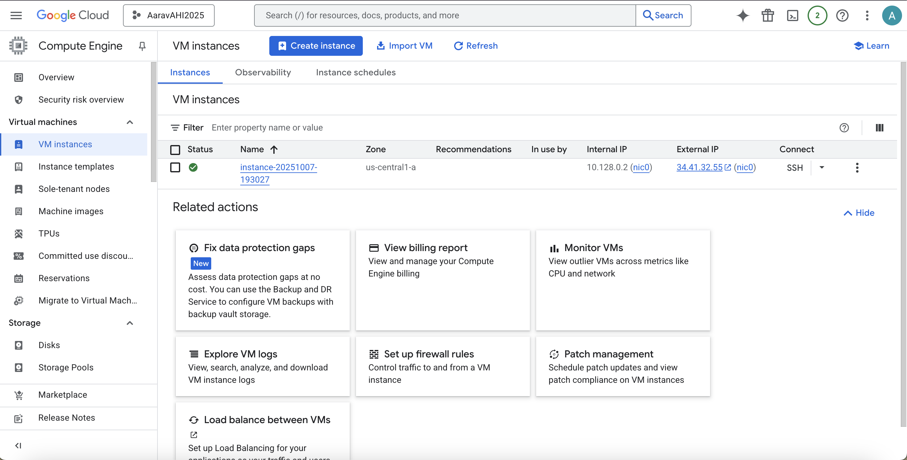
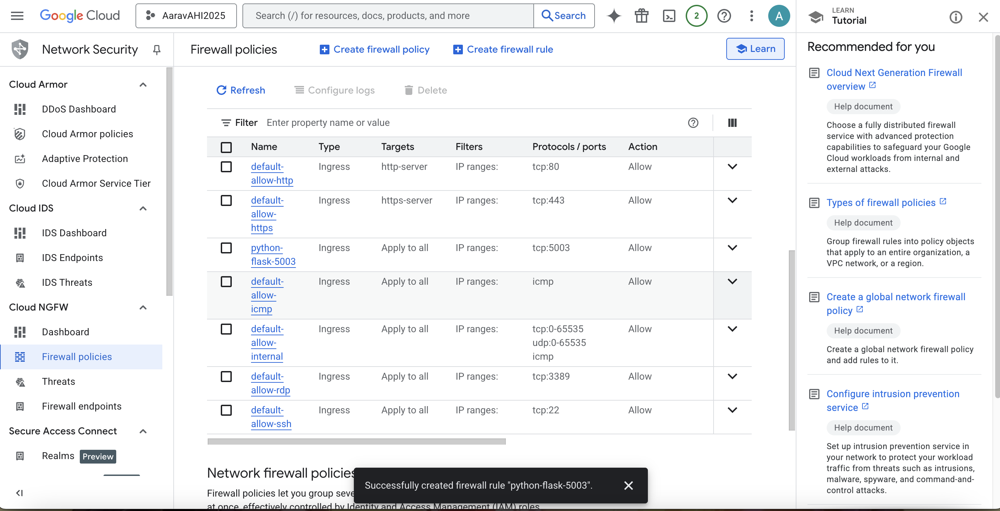
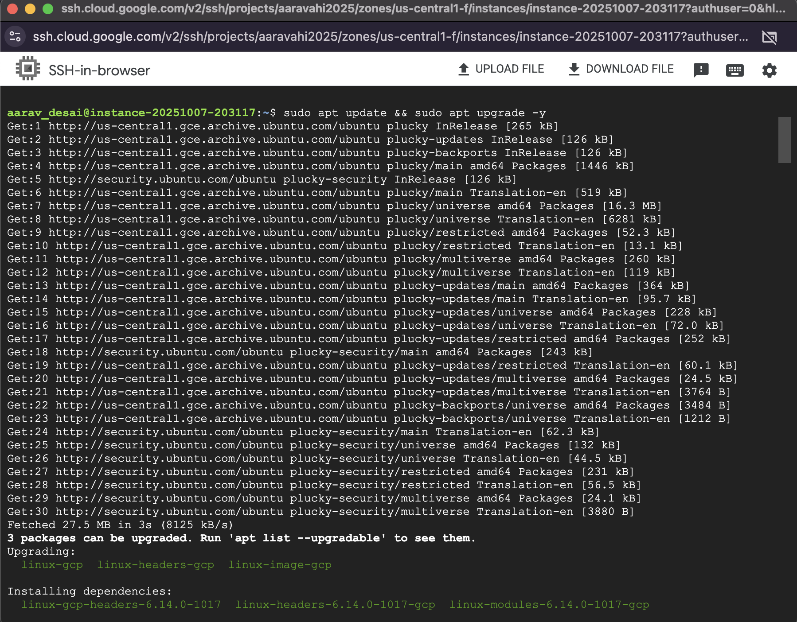
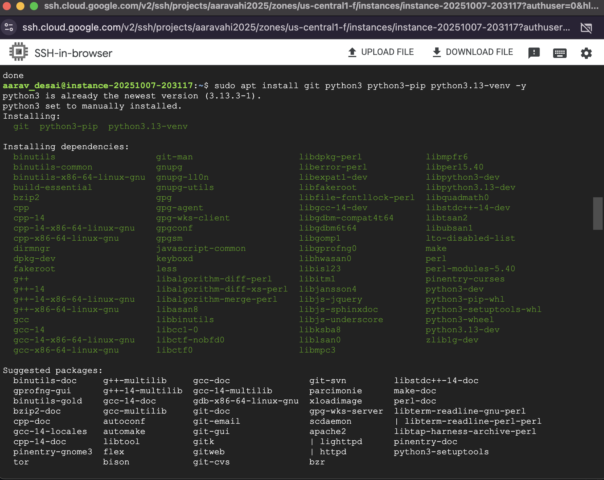
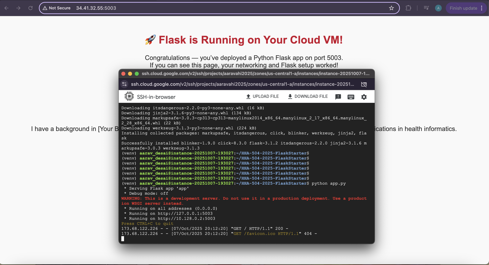
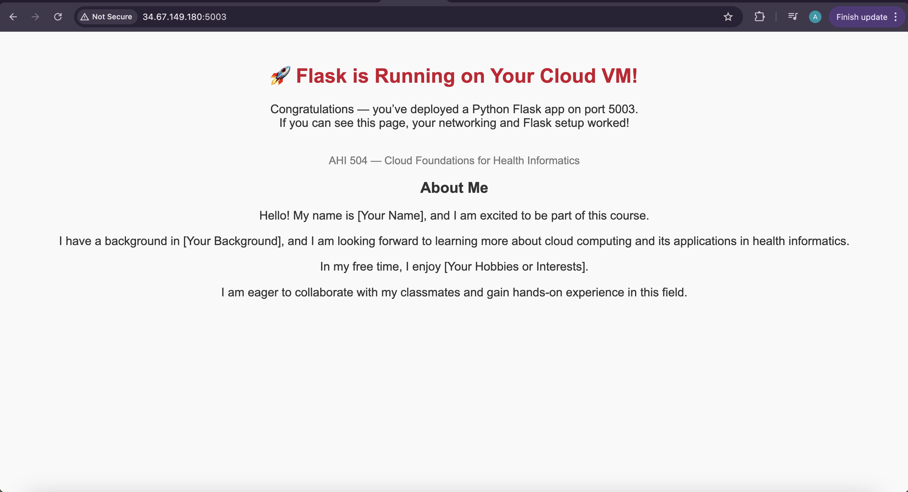

# Flask on Cloud VM (Assignment 2)

## Student Info
- Name:  Aarav Desai
- Cloud Provider:  Google Cloud

## Video recording: 
- Zoom/Loom: <[Zoom](https://drive.google.com/drive/folders/1gE6VDpZ2bISGLQ67lH9LoDyKOfAHF_Rs?usp=sharing)>

## Steps
### 1. VM Creation
[]

### 2. Networking (Port 5003 Open)
[]

### 3. OS Update + Python Install
[]
[]

### 4. Flask App Running
[]

### 5. Public IP Access
URL: http://34.67.149.180:5003/ 
[[]]

